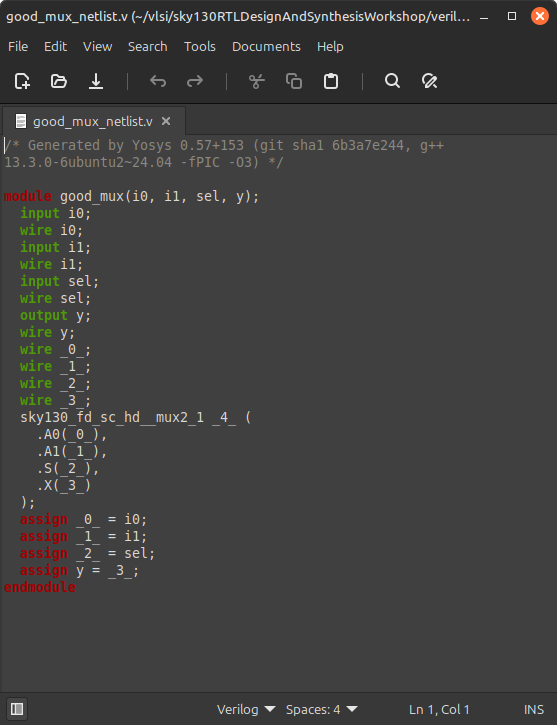

# VSD RISC-V Workshop – Week 1 Day 1

This document contains my notes and lab work for **Day 1** of the VSD RISC-V / RTL Design Workshop.  
The session focused on setting up open-source tools for simulation and synthesis, and running hands-on labs.

---

## 🔹 1. Getting Started with Icarus Verilog (iverilog)

**Icarus Verilog** is an open-source Verilog HDL simulator and compiler that supports Verilog-1995/2001/2005 and some SystemVerilog constructs.  
It works in two stages:  
1. Compilation of RTL + testbench into an executable.  
2. Running the executable with `vvp` to produce console/waveform output.  

It integrates well with **GTKWave** for waveform analysis and debugging.

### ✅ Lab: iverilog + GTKWave

**Step 1: Setup working directory**
```bash
mkdir vlsi
cd vlsi
git clone https://github.com/kunalg123/sky130RTLDesignAndSynthesisWorkshop.git
```


**Step 2: Navigate to Verilog files**
```bash
cd sky130RTLDesignAndSynthesisWorkshop/verilog_files
```


**Step 3: Compile and simulate**
```bash
iverilog good_mux.v tb_good_mux.v
vvp a.out
```


**Step 4: View waveform**
```bash
gtkwave tb_good_mux.vcd
```


---

## 🔹 2. Logic Synthesis with Yosys

**Yosys** is an open-source framework for **RTL synthesis**. It converts Verilog RTL to a gate-level netlist using standard cell libraries (e.g. Sky130).  
Key stages include parsing, optimization, and technology mapping.

### ✅ Lab: Yosys + Sky130 PDK

**Step 1: Start Yosys**
```bash
cd sky130RTLDesignAndSynthesisWorkshop/verilog_files
yosys
```

**Step 2: Read libraries and design files**
```bash
read_liberty -lib ../lib/sky130_fd_sc_hd__tt_025C_1v80.lib
read_verilog good_mux.v
```


**Step 3: Run synthesis**
```bash
synth -top good_mux
```


**Step 4: Technology mapping**
```bash
abc -liberty ../lib/sky130_fd_sc_hd__tt_025C_1v80.lib
```


**Step 5: Generate schematic**
```bash
show -format svg -prefix good_mux
```


**Step 6: Write netlist**
```bash
write_verilog good_mux_netlist.v
write_verilog -noattr good_mux_netlist.v
```



---

## 📌 Summary

- Explored **iverilog** for simulation and waveform analysis.  
- Learned basics of **Yosys** for synthesis with the **Sky130 PDK**.  
- Verified RTL → Gate-level flow with synthesis and netlist generation.  

📸 *Screenshot Placeholder – Final results / observations*

---

<p align="center">🚀 End of Day 1 🚀</p>
