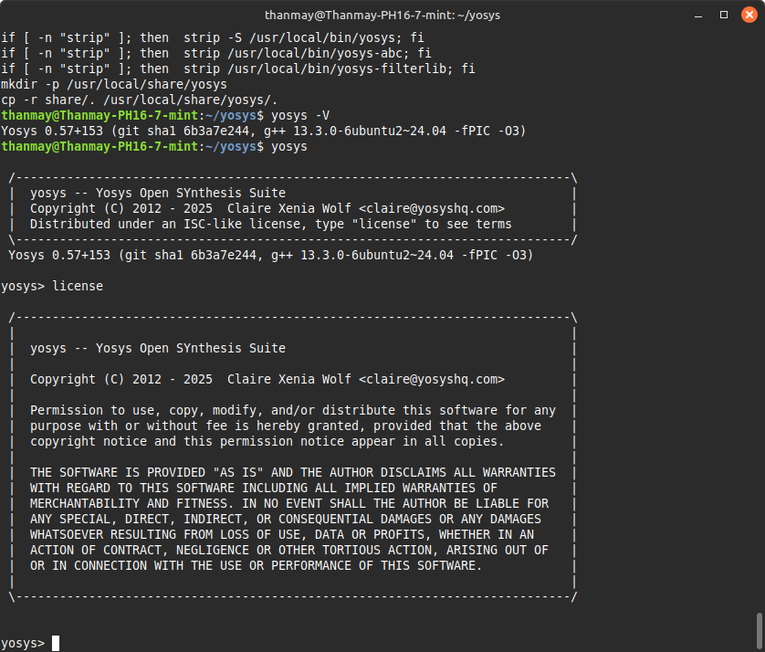
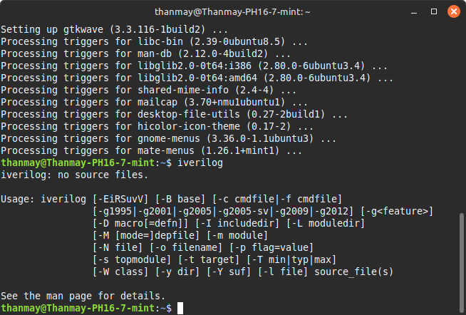
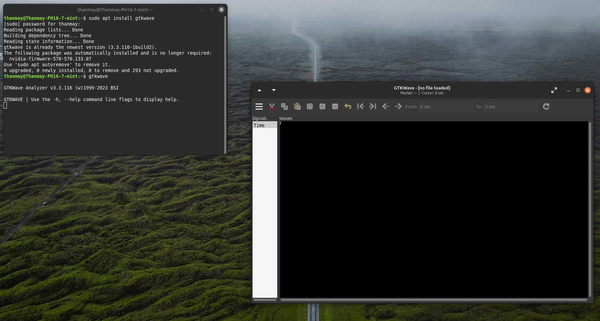
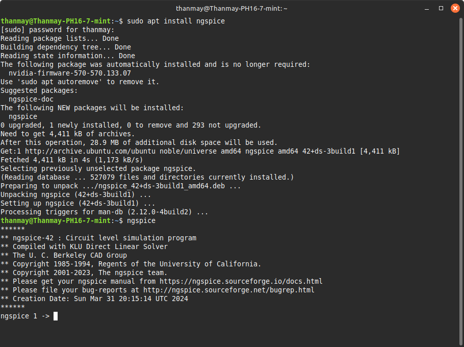
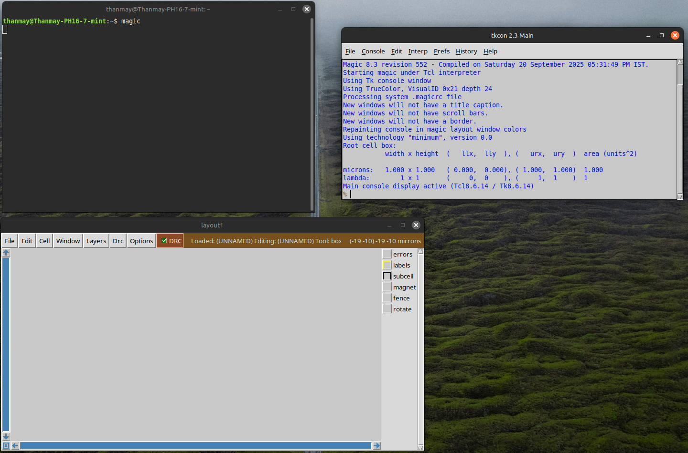

# t13nmy-riscv-tapeout

This repository documents the setup of tools required for the RISC-V Tapeout flow.  
Below are the steps followed and placeholders for verification screenshots.

---

## ✅ System Configuration
- **OS**: Linux Mint 22 (Ubuntu 24.04 base)
- **RAM**: 16
- **Disk**: 50 GB
- **CPU**: 24 CPU

---

## 📌 Day-0 Summary
- Introduction to VSD RISC-V workshop and EDA toolchain setup.  
- Virtual Machine setup requirements.  
- Tools installed in this session:  
  - Yosys  
  - Icarus Verilog (iverilog)  
  - GTKWave  
  - ngspice  
  - Magic  

---

## ⚙️ Installation Steps & Verification

### 🔹 Yosys
```bash
git clone https://github.com/YosysHQ/yosys.git
cd yosys
sudo apt install make build-essential clang bison flex libreadline-dev gawk tcl-dev libffi-dev git graphviz xdot pkg-config python3 libboost-system-dev libboost-python-dev libboost-filesystem-dev zlib1g-dev
git submodule update --init --recursive
make -j$(nproc)
sudo make install
yosys -V
```

📷 Screenshot:  


---

### 🔹 Icarus Verilog (iverilog)
```bash
sudo apt-get install iverilog
iverilog -V
```

📷 Screenshot:  


---

### 🔹 GTKWave
```bash
sudo apt install gtkwave
gtkwave --version
```

📷 Screenshot:  


---

### 🔹 ngspice
```bash
wget https://downloads.sourceforge.net/project/ngspice/ng-spice-rework/37/ngspice-37.tar.gz
tar -zxvf ngspice-37.tar.gz
cd ngspice-37
mkdir release && cd release
../configure --with-x --with-readline=yes --disable-debug
make -j$(nproc)
sudo make install
ngspice -v
```

📷 Screenshot:  


---

### 🔹 Magic
```bash
sudo apt-get install m4 tcsh csh libx11-dev tcl-dev tk-dev libcairo2-dev mesa-common-dev libglu1-mesa-dev libncurses-dev
git clone https://github.com/RTimothyEdwards/magic
cd magic
./configure
make -j$(nproc)
sudo make install
magic -v
```

📷 Screenshot:  


---

## 📂 Repo Structure (Suggested)
```
t13nmy-riscv-tapeout/
│── README.md
│── docs/
│    ├── day0_summary.md
│    ├── tool-installation/
│         ├── yosys.png
│         ├── iverilog.png
│         ├── gtkwave.png
│         ├── ngspice.png
│         ├── magic.png
```

---

✅ *End of README*
